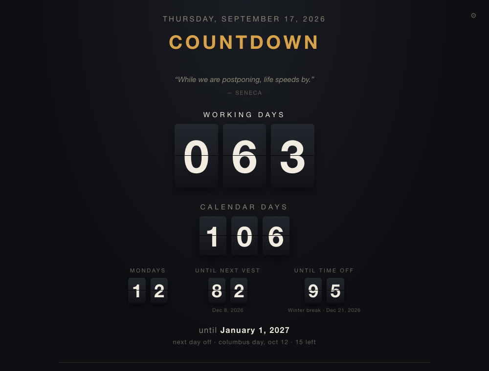
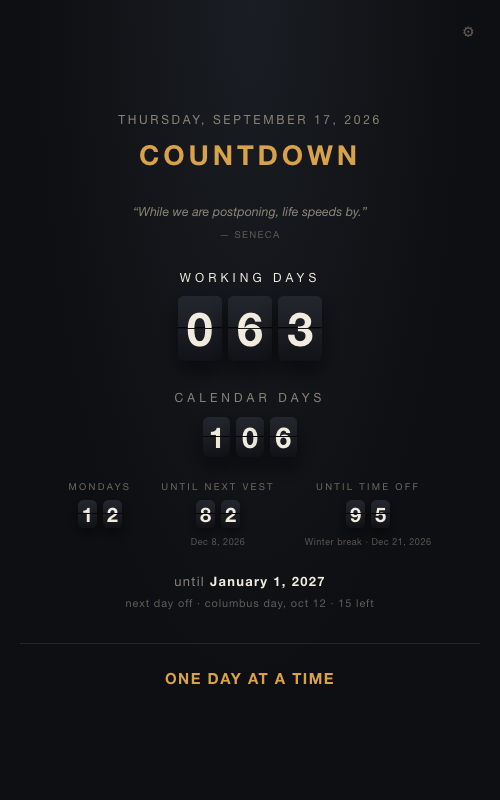

# Countdown

A split-flap departure board for the day you're waiting on. Working days,
calendar days, and as many smaller counters as you want underneath — the next
equity vest, the next holiday, the next trip.



It runs entirely in your browser. There is no server, no account, no database,
and no build step: it's a handful of HTML, CSS and JavaScript files. Put it on
GitHub Pages and it's live on a phone home screen in about five minutes.

**Your dates never leave your device.** Everything you type goes into your own
browser's storage, not into the repository — see [Privacy](#privacy).

---

## Getting it

Three ways, easiest first.

### 1. Just use someone's copy

Open a deployed copy, tap the gear, put your own dates in, and
[add it to your home screen](#put-it-on-your-phone). Settings live in *your*
browser, so you get your own board without copying anything. No GitHub account
needed.

> Using mine: **https://bdjsec.github.io/Countdown/**

### 2. Your own copy on GitHub Pages — free, ~5 minutes

You need a GitHub account. You do not need to know git, install anything, or
use a terminal.

1. Click **Use this template** at the top of
   [this repository](https://github.com/bdjsec/Countdown) → **Create a new
   repository**. Name it whatever you like — `Countdown` is fine. Leave it
   **Public** (Pages is free on public repos; on a private repo it needs a paid
   plan).
2. In your new repository, go to **Settings** (the tab along the top, not your
   account settings) → **Pages** in the left sidebar.
3. Under **Build and deployment** → **Source**, choose **Deploy from a branch**.
   Set the branch to **main** and the folder to **/ (root)**. Click **Save**.
4. Wait about a minute. Refresh that page and it will show
   *"Your site is live at https://YOURNAME.github.io/Countdown/"*. That's your
   board.
5. Open it, tap the gear, and fill in your dates.

If step 4 still shows a 404 after a couple of minutes, see
[Troubleshooting](#troubleshooting).

### 3. On your own machine

Download the files and open `index.html`… almost. Browsers refuse to load
JavaScript modules straight off the filesystem, so it needs to be *served*,
even locally:

```bash
python3 -m http.server 8000
```

Then open <http://localhost:8000>. Any static file server works.

---

## Put it on your phone

This is the point of the thing — it's built to live on a home screen, where it
opens full-screen with no browser chrome and works with no signal.

It has to be served over **https** for this to work properly, which GitHub
Pages does for you automatically.

**iPhone / iPad**
1. Open your board in **Safari** (Chrome on iOS works too on recent versions,
   but Safari is the reliable one).
2. Tap the **Share** button — the square with the arrow, at the bottom.
3. Scroll down and tap **Add to Home Screen**.
4. Name it and tap **Add**.

**Android**
1. Open your board in **Chrome**.
2. Tap the **⋮** menu, top right.
3. Tap **Install app**, or **Add to Home screen** if you don't see that.
4. Confirm.



Either way you get an icon that opens straight to the board. After the first
visit it works offline — it's cached on the device, and all the arithmetic
happens locally.

---

## Setting it up

Tap the **gear** in the top corner. Everything is in one panel.

**Board** — the title across the top, and an optional closing line at the
bottom. Both are free text; make them say whatever you want.

**Target** — the day you're counting to, and the time zone the board lives in.
The wording before the date ("until") is yours to change.

**Days off** — pick a holiday calendar as a starting point, then add your own
below it. One per line:

```
2026-12-24 Christmas Eve
2026-12-07..2026-12-11 Trip
```

A date on its own, or `start..end` for a run of them, then an optional name.
These come out of **Working Days** but not **Calendar Days** — those days still
pass whether you work them or not.

> The bundled calendar is the **US federal** one. Most employers don't observe
> all of it and add days of their own, so treat it as a starting point and
> correct it here.

**Counters** — add, remove and reorder what's on the board. Each one has a
label, a type, and a size. See [Counter types](#counter-types).

**Quotes** — the line under the title changes daily. Turn it off, or add your
own lines:

```
The trouble with the rat race is that even if you win, you're still a rat. — Lily Tomlin
```

Then hit **Save**.

### Counter types

| Type | Counts | You give it |
|---|---|---|
| **Working days** | weekdays left, minus every day off | nothing |
| **Calendar days** | every day left | nothing |
| **A particular weekday** | how many Mondays (or any day) are left, skipping days off | which day |
| **Next date in a list** | days to the next date still ahead | a list of dates — vests, paydays, renewals |
| **Next time off** | days to your next trip, then days left *of* it | date ranges |
| **One fixed date** | days to a single date | the date |

**Next time off** does double duty: the dates you give it also come out of your
working-day count, so a holiday goes in once rather than in two places. If you
want a countdown to something that *isn't* time off work — a concert, a
release date — untick **These are days off work**.

Sizes are **Large**, **Medium** and **Small**. Large and medium stack down the
middle; small ones sit in a row underneath. Two large counters is one too many —
the board reads best with one headline number.

### How the counting works

- **Today doesn't count; the target does.** So on the target day itself the
  board reads `0`, and it stops there rather than going negative.
- **Working days** are Monday–Friday minus everything in your days-off list.
- **Weekday counters** use the same rule, so a Monday that's a holiday isn't a
  Monday you have to show up for.
- **A day off that lands on a holiday isn't subtracted twice.**
- Dates in a **next date in a list** counter still count even if they fall
  after your target date.
- The board turns over at midnight **in the time zone you picked**, not the
  one you happen to be standing in.

---

## Privacy

Your vest dates, your holidays and your trips are nobody's business. They are
saved in your browser's local storage, on that device, and they are never sent
anywhere and never written to the repository. `config.json` in the repo holds
only the blank defaults everyone starts from.

Two things follow from that:

- **Settings are per device and per browser.** Your laptop and your phone each
  need setting up. Use **Export** to save a settings file and **Import** to
  load it on the other one.
- **Clearing site data clears them.** So does private browsing, which usually
  blocks saving entirely — the panel will tell you if that's happening.

If you'd rather commit your dates so every device gets them — fine, but do it
with your eyes open: put them in `config.json` and **make the repository
private**, and remember that Pages on a private repo needs a paid GitHub plan.

---

## Troubleshooting

**404 after enabling Pages.** Give it two or three minutes for the first build.
Then check Settings → Pages says branch `main` and folder `/ (root)`, and that
you're using the exact URL it shows, trailing slash and all.

**The page loads but it's blank.** Almost always a path problem from an edit —
every link in `index.html` has to stay relative (`./app.css`, not `/app.css`),
because your site lives at `/Countdown/` rather than at the domain root. Open
the browser console and look for 404s.

**My changes aren't showing up.** The app caches itself so it can work offline,
which makes it stubborn about updates. Hard-refresh (**Ctrl/Cmd + Shift + R**).
On a phone, remove the home-screen icon and add it again.

**My settings vanished.** Private browsing, a cleared cache, or a different
browser than the one you set it up in. This is what **Export** is for.

**The dates are a day out.** Check the time zone under **Target**. "Match this
device" follows whatever device you're looking at it on; pick an actual zone to
pin it.

---

## Hosting it somewhere else

Any static host works — there's nothing to run.

- **Netlify** — drag the folder onto <https://app.netlify.com/drop>.
- **Cloudflare Pages** — connect the repo, leave the build command empty, set
  the output directory to `/`.
- **Your own server** — copy the files into any directory it serves. No Python,
  no Node, no reverse proxy config.

If you serve it from a domain root rather than a subdirectory, everything still
works: the paths are relative either way.

---

## Development

No dependencies, no build, no bundler. Edit a file and reload.

```bash
python3 -m http.server 8000
```

The date arithmetic is all in [`js/counters.js`](js/counters.js) — pure
functions, no DOM — which is what the tests exercise:

```bash
node test/run.js
```

Or open <http://localhost:8000/test/> to run the same suite in a browser.

| File | What's in it |
|---|---|
| `js/counters.js` | every date calculation; no DOM, fully tested |
| `js/flap.js` | the split-flap rendering and flip animation |
| `js/config.js` | defaults from `config.json`, overrides from local storage |
| `js/settings.js` | the settings panel |
| `js/main.js` | wiring, rendering, daily rollover |
| `presets/` | holiday calendars |
| `sw.js` | the service worker that makes it work offline |
| `tools/make_icons.py` | regenerates the PNG icons (needs Pillow) |

**Changing the icon.** `icons/favicon.svg` is the browser tab icon. Home-screen
icons have to be PNG, so they're generated and committed:

```bash
pip install pillow && python3 tools/make_icons.py --letter B
```

Then edit `icons/favicon.svg` to match.

**If you edit a file in the shell list in `sw.js`,** bump `CACHE` at the top of
that file so returning visitors get the new version.

---

## License

MIT — see [LICENSE](LICENSE). Do what you like with it.
